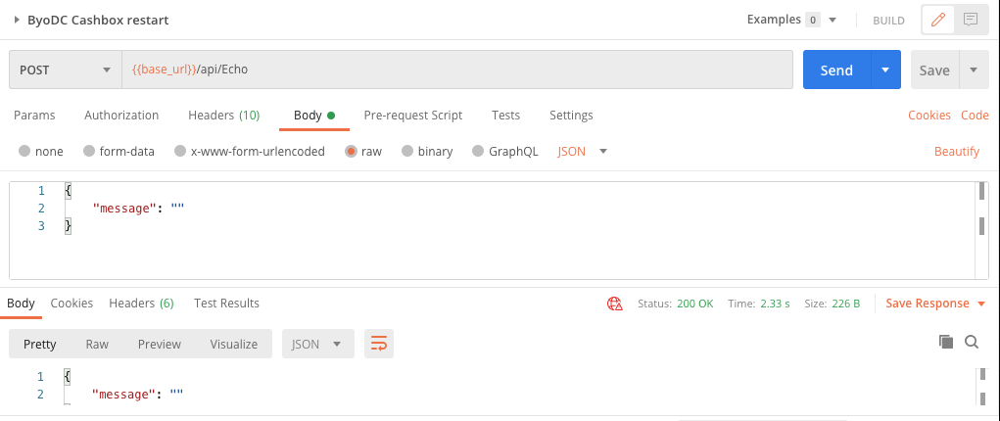
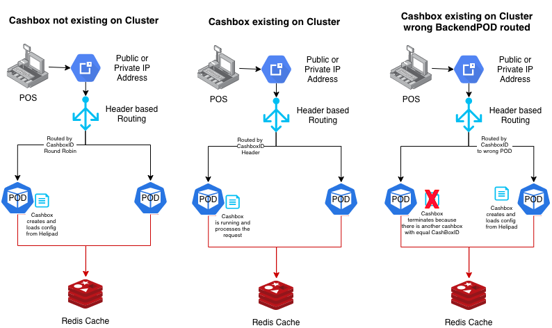

### fiskaltrust "Bring your own Datacenter"
# Operations Reference

## Reset Cashbox via Echo Endpoint
Since several Cashboxes are hosted in one BackendPOD, there could be the requirement to restart only one particular Cashbox (f.i. to reload its config). To do so, the Echo Endpoint can be triggered.
```sh
/api/Echo

Body:
{
    "message": ""
}
```
By passing CashboxID and Accesstoken, the Cashbox does a immedeate reset and reload its config from helipad.fiskaltrust.cloud.

See our [Postmancollection](https://github.com/fiskaltrust/product-de-bring-your-own-datacenter/blob/master/fiskaltrust%20DE%20ByoDC%20TestCall.postman_collection.json) for an example call:


This Endpoint can also be triggered several times sequential (e.g. in a bulk update scenario)

### Restart of all Cashboxes
In a massive update scenario (all or the vast majority of cashboxes were rebuilded) it is possible to restart all BackendPODs by triggering a rolling restart. K8S will send the SIGTERM Signal to the affected POD so current requests should be completed properly.

Example:
```
kubectl config set-context --current --namespace=bring-your-own-datacenter 
kubectl get deployments 
kubectl rollout restart deployment byodc
```


## LogFiles
fiskaltrust Middleware in ByoDC does not support local Logfiles.  
Usual logging practice in K8S environments is to handle logs via stdout/stderr.
https://kubernetes.io/docs/concepts/cluster-administration/logging/#cluster-level-logging-architectures

## Replace Abassador Loadbalancer
Ambassador PODs are the default Loadbalancers for ByoDC. There is an important reason for that. For Backend PODs to work properly, it is essential that every cashbox is a singleton on the whole ByoDC cluster.  
So we use _Header based Routing_ by the CashBoxId. If a cashbox is already existing on a BackendPOD, the load balancer routes this request always to the same BackendPOD (like a sticky session). If this Cashbox is not existing it will be created and gains a Redis Lock. In this case the cashbox loads its config from helipad, this may take some time.

**Attention:** Keep in mind, if you replace the ambassador PODs by another solution, that this behaviour is exact the same. Otherwise you may encounter unexpected timeouts and performance issues!  


## Supported Rollout Scenarios
In Contrast to the local installed middleware (ft-launcher), ByoDC supports only scenarios where each cashbox contains exact 1 Queue and 1 SCU.
Figuratively, those parts of our rollout scenarios are included:
- https://docs.fiskaltrust.cloud/docs/posdealers/rollout-doc/middleware#a-cloud-tse-for-multiple-cash-registers  
- https://docs.fiskaltrust.cloud/docs/posdealers/rollout-doc/middleware#rollout-scenario-with-terminals  
 
All other documented scenarios are not applicable to ByoDC deployments.

