### fiskaltrust "Bring your own Datacenter"
# QuickStart

This document includes a step-by-step manual to run fiskaltrust ByoDC local on Docker Desktop for testing purposes.

### Requirements
- Docker Desktop (including Kubernetes activated)
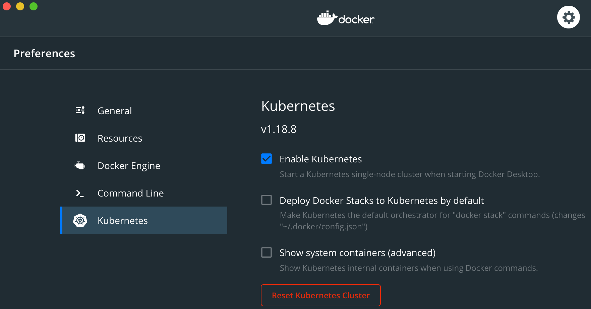

## 1.) Install Helm
See [Helm documentation](https://helm.sh/docs/intro/install/)

## 2.) Create Kubernetes Namespace
```sh
kubectl create namespace bring-your-own-datacenter
```

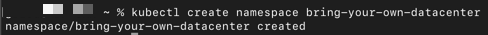

## 3.) Add Helm Repo
```sh
helm repo add fiskaltrust https://charts.fiskaltrust.cloud/
```
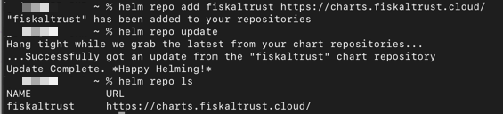

## 4.) Install HelmChart

### Option 1 (plain, without mysql container)

```sh
helm install bring-your-own-datcenter fiskaltrust/bring-your-own-datacenter --namespace bring-your-own-datacenter
```
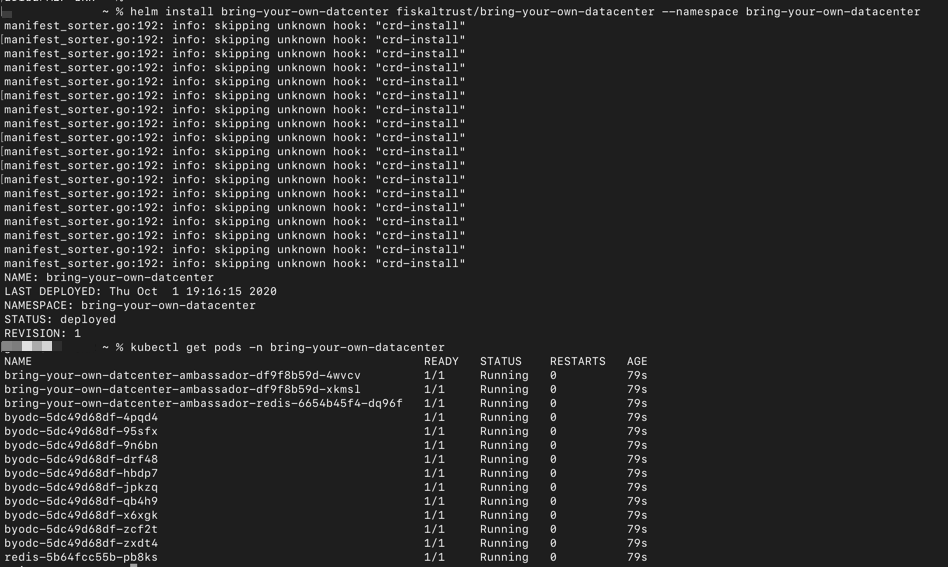

### Option 2 (with mysql container)

If you would like to have a mysql container for easy testing, you can add a config setting before installing the HelmChart as follows:

1.  create a ```config.yaml``` file and add following content:
```
ambassador:
  config:
    tls:
      enabled: false
mysql:
  enabled: true
```
2. pass the created  ```config.yaml``` file with the helm install command:

```sh
helm install bring-your-own-datcenter fiskaltrust/bring-your-own-datacenter --namespace bring-your-own-datacenter -f config.yaml
```
This will additionally create a mysql container that you can use in Step 6.) when configuring the Queue for testing.

## 5.) Test reachability in the Browser

Before testing reachability in the browser please wait a couple of minutes because the first time Kubernetes has to pull the Docker Image, this may take a while.

```sh
http://localhost/api/version
```
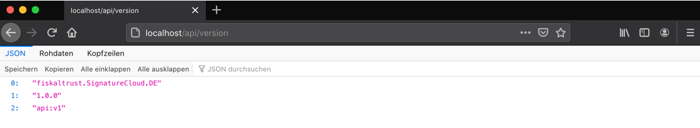

## 6.) Create a Cashbox in the [Sandbox ft.Portal](https://portal-sandbox.fiskaltrust.de/CashBox)

6.1) First create a new Queue

- choose the Package ```fiskaltrust.Middleware.Queue.MySQL```

- insert a value for the ```CashboxIdentification``` field - this will be used as the POS System serial number (Kassenseriennummer) and as a client id in the TSE. It must be a [printable string](https://en.wikipedia.org/wiki/PrintableString) with a maximum length of 20 characters.

- add a htp(REST) endpoint by clicking the corresponding button

- Press "Save" and in the next form insert your mysql Connectionstring:

  (e.g. Server=mysql;Port=3306;Uid=root;Pwd=password;)
  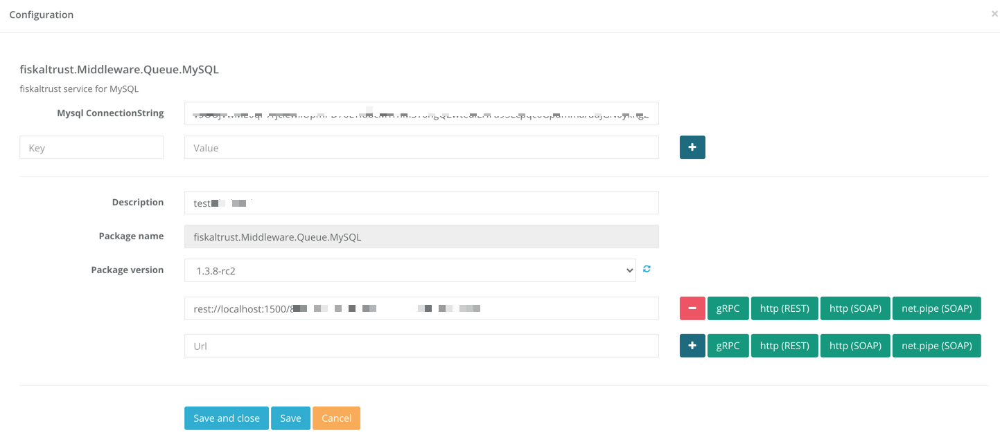

- Save and close

6.2 ) Next create a new SCU 

- For testing you can use a fiskaly TSE.  To obtain the TSE access data, register in the [fiskaly dashboard](https://dashboard.fiskaly.com/) and create there a test TSE. 
- create the new SCU in the portal and choose the Package ```fiskaltrust.Middleware.SCU.DE.Fiskaly```
- press "Save" and next enter the TSE credentials received from the fiskaly dashboard.
- create a grpc endpoint by pressing the corresponding button. 
- Save and close.

6.3) Create a new Cashbox
- enter a name an press the "Save" button. 
- in the list of cashboxes press the "edit by list" button in the row of the newly created cashbox 
- in the appearing screen select the newly created Queue and SCU to add them to the new cashbox and press "Save"
- back in the list of cashboxes expand the row of the newly created cashbox and press the first button right to the Queue name (arrow right up). A popup appears with a list of SCUs. Select the newly created SCU to connect the Queue with the SCU.
- in the same list of cashboxes press the "Rebuild configuration" button in the row of the newly created cashbox.
- expand this row to see the credentials of the cashbox (```CashBoxId``` and ```Access token```)

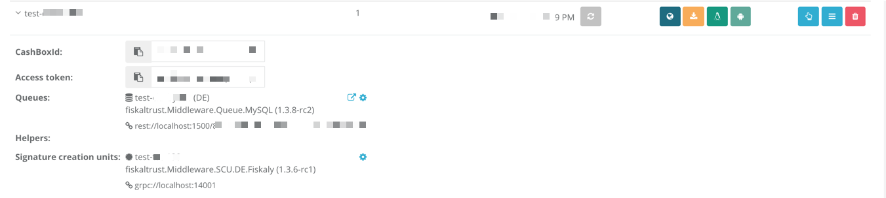

After changing values inside the cashbox (including Queue and SCU), don't forget to rebuild the cashbox configuration!

## 7.) Test with Postman

7.1) Start our ByoDC test collection directly from here: [](https://app.getpostman.com/run-collection/4cc81f9afe8e40d93883)

 or start Postman, download and import the [ByoDC test collection](https://github.com/fiskaltrust/product-de-bring-your-own-datacenter/blob/master/fiskaltrust%20DE%20ByoDC%20TestCall.postman_collection.json).

7.2) Edit the collection and set the current value for the variables cashbox_id and accesstoken with the credentials from the fiskaltrust portal (see step 6.3). This will automatically add them to the headers of the requests.

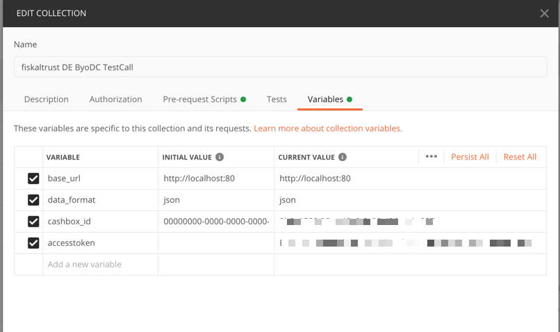


7.3) Send the echo request to see if the queue is reachable. The echo request can also be used to relaod an updated configuration (after pressing the rebuild configuration button in the portal).

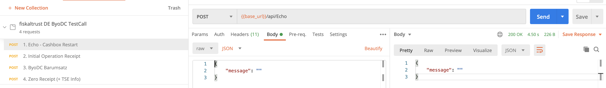


7.4) Send the initial operation request to register the cashbox as a client in the TSE. This will also initialize the TSE if it is not yet initialized.

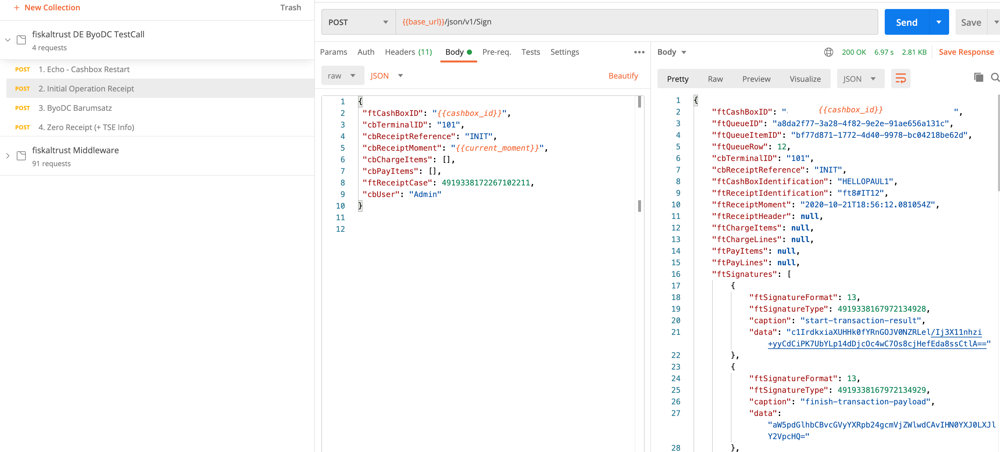


7.5) Send the pos-receipt (ByoDC Barumsatz).#
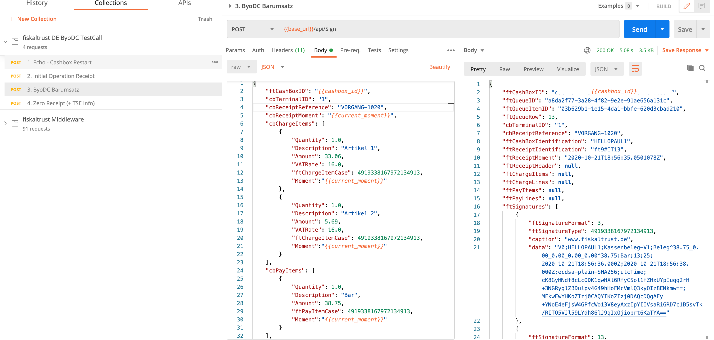


7.6) Request the TSE Info by sending the flagged zero receipt.

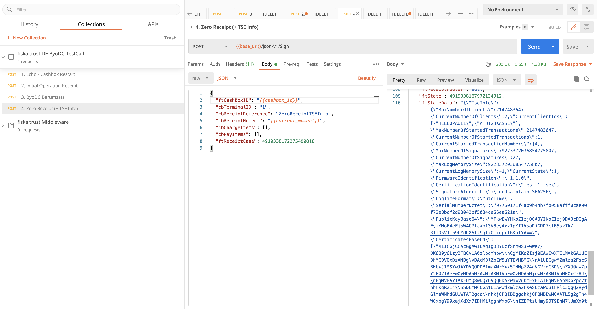

## 8.) Hints

If you later need to delete the namespace you can do it with following command:

```sh
kubectl delete namespace bring-your-own-datacenter
```

