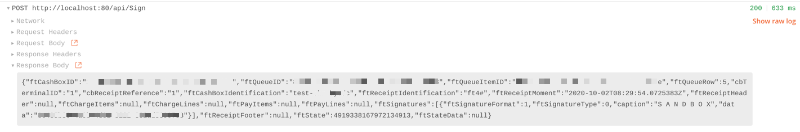

### fiskaltrust "Bring your own Datacenter"
# Quickstart

This document includes a step-by-step manual to run fiskaltrust ByoDC local on Docker Desktop to get up and running.

### Requirements
- Docker Desktop (including Kubernetes activated)


## 1.) Install Helm
See [Helm documentation](https://helm.sh/docs/intro/install/)

## 2.) Create Kubernetes Namespace
```sh
kubectl create namespace bring-your-own-datacenter
```


## 3.) Add Helm Repo
```sh
helm repo add fiskaltrust https://charts.fiskaltrust.cloud/
```


## 4.) Install HelmChart
```sh
helm install bring-your-own-datcenter fiskaltrust/bring-your-own-datacenter --namespace bring-your-own-datacenter
```


## 5.) Test in Browser
```sh
http://localhost/api/version
```


## 7.) Cashbox and Queue Config
Create Cashbox and Queue Config (See [fiskaltrust Documentation](https://docs.fiskaltrust.cloud/doc/portal-manual-doc/doc/handbook-general/configuration.html))


## 6.) Test with Postman
Start Postman and import the test [collection](fiskaltrust DE ByoDC TestCall.postman_collection)


