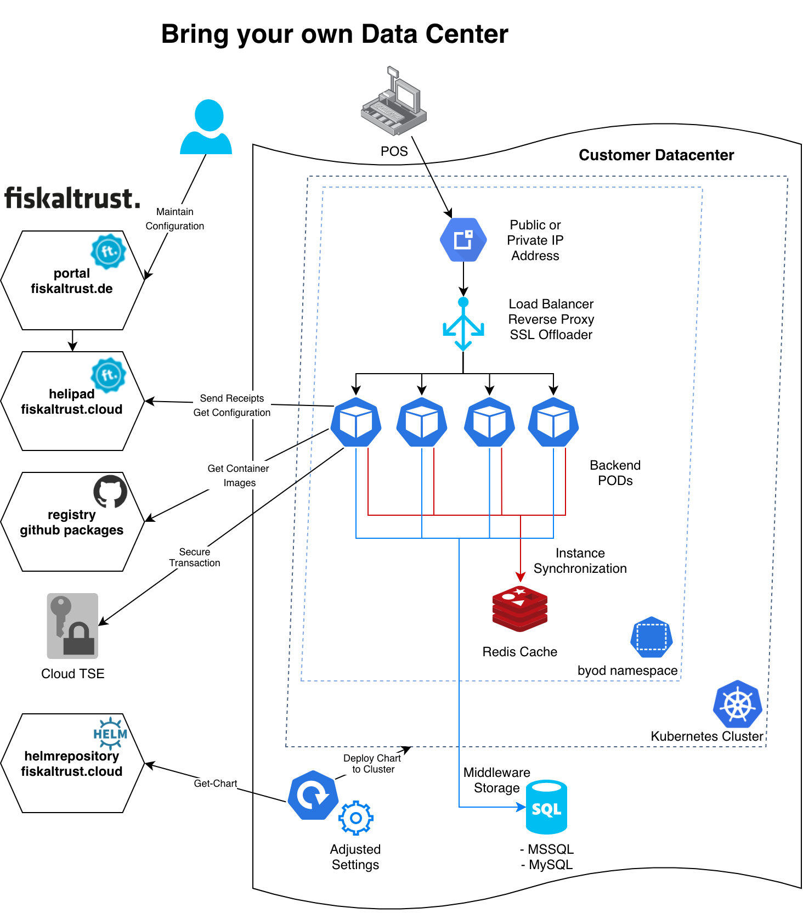

# product-de-bring-your-own-datacenter

### problem description:
You have a distributed architecture of your point of sale system and therefore you are not able to connect a tse device directly to your pos-terminal. An on site (branchoffice) installation of the fiskaltrust.Middleware is not possible or would not be efficient.

### solution proposal:
By providing a standardized hardware platform by the customer, fiskaltrust.Middleware using a cloud-tse can be brought to the datatcenter directly where the receipt generation process of a distributed point of sale system occurs. This can be devlivered by a predefined Kubernetes Namespace which can be deployed by a Helm-Chart.
fiskaltrust provides a "Backend POD" Docker image and Helm-Charts to deploy your own envoironment.

## Architecture Overview


## Requirements

* Kubernetes cluster > v1.16
* helm > v3.0


## Installation

### Create Namespace

Connect to your Kubernetes cluster and create the `bring-your-own-datacenter` namespace.

```sh
kubectl create namespace bring-your-own-datacenter
```

### Add helm repository

First add the fiskaltrust helm repository.

```sh
helm repo add fiskaltrust https://charts.fiskaltrust.cloud/
```

> ***Note:** You can also skip this step, clone this repo and use the path to the `Chart.yaml` file as repo in the following commands.*

### Configure values

You can view all configurable values by running the following command.

```sh
helm show values fiskaltrust/bring-your-own-datacenter
```

This will output a `values.yaml` file containing all of the default values. You can create a file `config.yaml` and override the values you need.

### Install chart

You can install the chart like this:

```sh
helm install bring-your-own-datcenter fiskaltrust/bring-your-own-datacenter --namespace bring-your-own-datacenter -f config.yaml
```

Leave out `-f config.yaml` to install it with default values.

> ***Note:** If you use a local repo you will have to run `helm dependency update` before installing.*


## Uninstallation

```sh
helm uninstall bring-your-own-datacenter --namespace bring-your-own-datacenter
kubectl delete namespace bring-your-own-datacenter
```