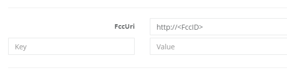

# Host FiscalCloudConnector instances in Bring your own Data Center

It is possible to host a FiscalCloudConnector as a docker container. ByoCD can be configured to host preconfigured FCC.

## ByoDC Configuration

The helm chart needs to be provided with the FccId () and FccSecret () of each FCC.

To do that add the following to the `config.yaml` file:

```yaml
fcc:
  instances:
    - vtssId: <FccId>
      vtssSecret: <FccSecret>
```

Each fcc gets assigned a volume containing the `.fccdata`. This volume is created using a `PersistentVolumeClaim`.

Per default the default storageClass of your cluster and a capacity of 1GB is used.\
This can be overriden like so:

```yaml
fcc:
  config:
    storage:
      class: <storageClass>
      capacity: <defaultCapacity>
```

Per default the same volume capacity is used for all FCCs.\
The capacity can also be set per FCC like so:

```yaml
fcc:
  instances:
    - vtssId: <FccId>
      vtssSecret: <FccSecret>
      capacity: <overrideCapacity>
```

> More configuration options are listed in the [parameter reference](ParameterReference.md).

## SCU Configuration

SCUs need to be setup to use byodc hosted FCC instances.

To do so the `FccUri` parameter needs to be set to `http://<FccId>` in the fiskaltrust.Portal.


